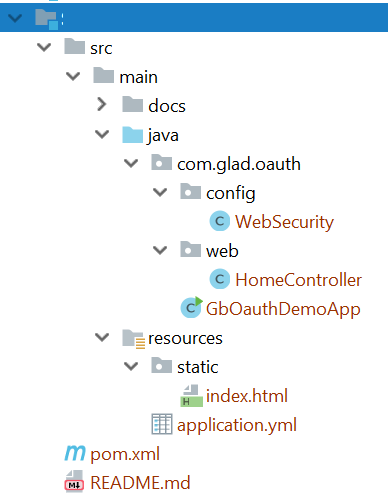

# gb-oauth2-springboot-talk
Under the hood of social login w/ Springboot and OAuth/OIDC takes
step by step approach to help understand OAuth/OIDC
authorization code flow and demonstrates it with example
using Spring Boot 2.x and Spring Security 5. Code demos are based off
[OAuth 2.0 Login Sample](https://github.com/spring-projects/spring-security/blob/5.0.7.RELEASE/samples/boot/oauth2login/README.adoc)
from Spring Security

## Abstract:
You may have used your Google or Facebook account to login
into some third-party website (e.g. Stack Overflow) and such
social login happens without user having to expose their
credentials to third-party. Music app on mobile device is able
to post updates to your Facebook account, third-party can use
Twitter API to add certifications to user profile.

Modern application development is composed of micro-services
and APIs that needs to be secured while we want folks from
different department or even third-party to develop web
or mobile applications to consume them.

Most of such use cases are mostly enabled by
technology called OAuth and Open ID Connect (OIDC).

## [Session Presentation](src/main/site/OAuthSocialLogin.pdf)

* Presentation PDF `#`**[OAuth Social Login](src/main/site/OAuthSocialLogin.pdf)**

* Please see `#`**[References](References.md)** for some more helpful content

## Code Demo

Replace respective `client-id` and `client-secret` before running the demo

* [Step-01 Initial Spring Security App](Step-01-InitialSpringSecurityApp)

* [Step-02 OAuth Simple Social Login](Step-02-OAuthSimpleSocialLogin)

* [Step-03-OpenIDConnectLogin](Step-03-OpenIDConnectLogin)

* [Step-04-CustomProviderLogin](Step-04-CustomProviderLogin)

### Each Demo file structure

### Demo Prerequisite:
* Java Web Development
* Springboot and Spring Security
* HTML/CSS/JavaScript

