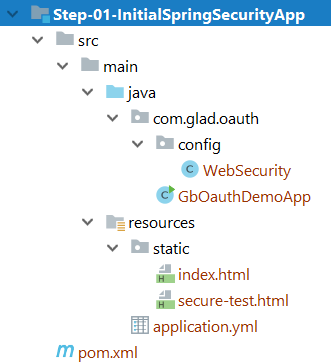

## Step-01-InitialSpringSecurityApp

This project has none of the OAuth code/component, it just sets up initial Spring Security.


Once you run the project (`GbOauthDemoApp`), since spring security is included, 
this will wire up default auto config of spring security. App can be accessed at 
url `http://localhost:8080/` with username as `user` and password that is 
printed in console log with line similar to shown below.
```
Using generated security password: e89fhdc3-5da5-4gc1-83b1-a2g7bd77416a
``` 

### Customizing web security
By default `WebSecurity` config is not enabled in this project as `@Configuration` 
is commented out to demonstrate default spring security. Uncomment `@Configuration` 
and run the project again. This time instead of BASIC auth, spring security built-in 
login form is displayed.
 
Most of the code here is self explanatory and has been annotated with additional 
comments where necessary. If you want to explore further, I'd recommend you to take a look at
[Spring Security Architecture](https://spring.io/guides/topicals/spring-security-architecture/)
and [Spring Security Reference](https://docs.spring.io/spring-security/site/docs/current/reference/htmlsingle/)

### spring security logging
For demo purpose, we also set spring security logging to DEBUG so we can observe the logs if we want to.
